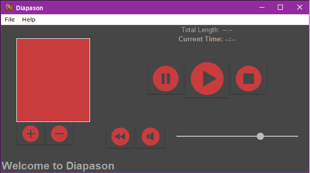
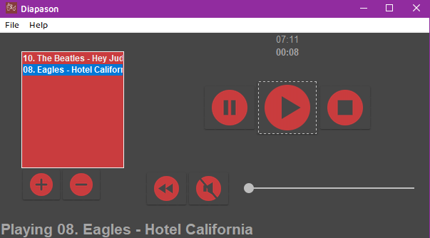

# diapason
Windows music player built with Python 3.8.3 and Tkinter! 
Supports WAV, OGG, MOD, XM, and MP3 (Thanks PyGame!).

## diapason (noun)
    di·​a·​pa·​son | \ ˌdī-ə-ˈpā-zᵊn  , -sᵊn \

### First Definition
    1a: a burst of sound (diapasons of laughter)
     b: the principal foundation stop in the organ extending through the complete range of the instrument
     c: the entire compass of musical tones (2): RANGE, SCOPE
        registers the full diapason of her responses

### Second Definition
    2a:  TUNING FORK
     b: a standard of pitch
